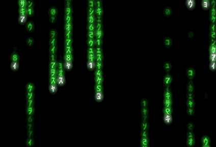

# go-matrix-code
Recreation of the Matrix Digital Rain in Golang + [raylib](https://github.com/gen2brain/raylib-go).



Font by [NORFOK™](https://www.norfok.com/)

## Requirements
- Go version 1.16
- raylib dependencies, check [raylib's docs](https://github.com/gen2brain/raylib-go)

## Build
Tested on Windows 10. Should work on other systems as well.

```
git clone https://github.com/haroflow/go-matrix-code
cd go-matrix-code
go build .
```

## Run
```
# Help
go-matrix-code.exe -help
  -fullscreen
        Starts in fullscreen mode

# Windowed
go-matrix-code.exe

# Fullscreen
go-matrix-code.exe -fullscreen
```
